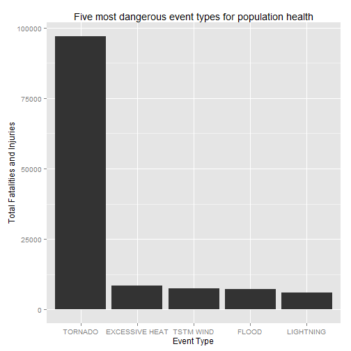
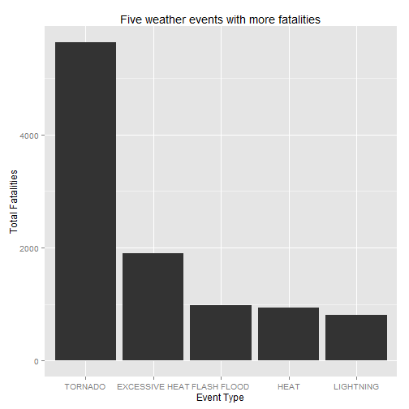
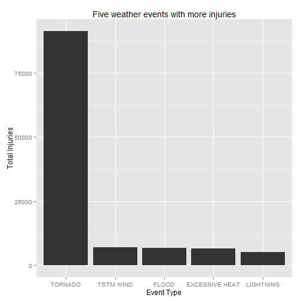
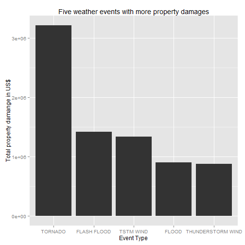

##Reproducible Research Project 2

#Synopsis

In the current report we are anylising data from the U.S. National Oceanic and Atmospheric Administration's (NOAA) storm database. The idea of the research was to divide property damage, injuries and fatalities among all kinds of natural events and find out which events are more harmful. In the end of the report we created some charts to analyse the ten more harful events in each cathegory. It was interesting to find out that Tornados are the most harmful event both in terms of property and health damage for the US population. 

#Data Processing

Below the code to read raw data from the original .csv file


```r
  library(plyr)
  storm_data<-read.csv(bzfile("C:/Users/Cla/Downloads/repdata-data-StormData.csv.bz2"),
                       stringsAsFactors = FALSE)
```

After the file was read, it was transformed into a smaller database, we just kept the necessary information (columns) for this research:

Type of event: "EVTYPE"
Number of fatalities: "FATALITIES"
Number of injuries: "INJURIES"
Total value of property damages: "PROPDMG"


```r
  small_data<- storm_data[,c("EVTYPE", "FATALITIES", "INJURIES", "PROPDMG")]
```

First we create a subdata compiling the sum of fatalities and injuries grouped by event type in order to find out which event is the most dangerous for human health. Additionally we extract the five most harmful events and created a chart to present the results.


```r
  library(ggplot2)
  subdata <- ddply(small_data, .(EVTYPE), summarize, agregate = sum(FATALITIES, INJURIES))
  orderdata<- subdata[order(subdata$agregate, decreasing=T),]
  most_harm<- orderdata[1:5,]
  ggplot(most_harm, aes(x=reorder(EVTYPE, -agregate), y=agregate)) +
  geom_bar(stat="identity") +
  xlab("Event Type") +
  ylab("Total Fatalities and Injuries") +
  ggtitle("Five most dangerous event types for population health")
```

 

Second we analysed two new subdatas, one specific for fatalities and other just for injuries. The reason for this approach is that we understand that it is very important to have a clear view of the specific number fatalities and injuries. We also create two separate charts to analyse injuries and fatalities.


```r
  par(mfrow=c(1,2))

  subdata_fat<- ddply(small_data, .(EVTYPE), summarize, agregateF = sum(FATALITIES))
  orderdata_fat<- subdata_fat[order(subdata_fat$agregateF, decreasing=T),]
  most_fat<- orderdata_fat[1:5,]
  
  subdata_inj<- ddply(small_data, .(EVTYPE), summarize, agregateI = sum(INJURIES))
  orderdata_inj<- subdata_inj[order(subdata_inj$agregateI, decreasing=T),]
  most_inj<- orderdata_inj[1:5,]

  ggplot(most_fat, aes(x=reorder(EVTYPE, -agregateF), y=agregateF)) +
  geom_bar(stat="identity") +
  xlab("Event Type") +
  ylab("Total Fatalities") +
  ggtitle("Five weather events with more fatalities")
```

 

```r
  ggplot(most_inj, aes(x=reorder(EVTYPE, -agregateI), y=agregateI)) +
  geom_bar(stat="identity") +
  xlab("Event Type") +
  ylab("Total Injuries") +
  ggtitle("Five weather events with more injuries")
```

 

Finaly, we created a new subdata specific for property damage also grouped by weather events. We also created a chart including the five more important weather events in terms of property damage.


```r
  subdata_prop <-ddply(small_data, .(EVTYPE), summarize, agregate = sum(PROPDMG))
  orderdata_prop<- subdata_prop[order(subdata_prop$agregate, decreasing=T),]
  most_dmg<-orderdata_prop[1:5,]

  ggplot(most_dmg, aes(x=reorder(EVTYPE, -agregate), y=agregate)) +
  geom_bar(stat="identity") +
  xlab("Event Type") +
  ylab("Total property damange in US$") +
  ggtitle("Five weather events with more property damages")
```

 
